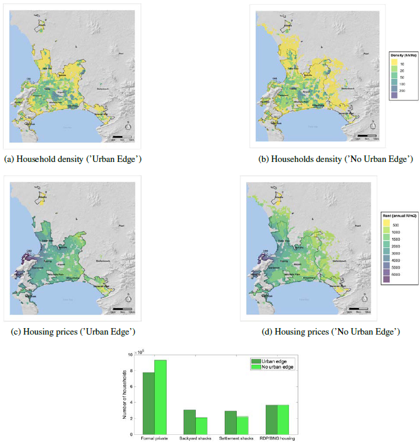

========
Use case
========

.. Write about topics instead!

--------------
Past use cases
--------------

Within the context of the CoCT, :cite:t:`pfeiffer` have been studying two policy use cases.

* The impact of an urban growth boundary over population density and sorting across housing markets

   Simulation results for the "Urban Edge" and "No Urban Edge" scenarios (*Source*: :cite:t:`pfeiffer`)

* The impact of public housing provision scenarios on spatial sorting of poor households through the backyarding channel

.. figure:: images/rdp_projects.png 
   :scale: 70% 
   :align: center
   :alt: maps of predicted future public housing projects over the short and long term

   Pipeline of future subsidized housing projects (*Source*: :cite:t:`pfeiffer`)

   Change in the number of income group 1 and 2 households by housing type and scenario (*Source*: :cite:t:`pfeiffer`)

----------------
Current use case
----------------

In the current implementation, we add flood risk anticipations to the model and discuss policies that mitigate the associated damages within a framework in which agents adapt their behavior. We focus on land-use policies, and more specifically on informal settlement expansion scenarios. Note that we could, in theory, assess the impact of a variety of other policies, such as localized flood protection investments (in the spirit of :cite:t:`avner`). To conduct a proper cost-benefit analysis however, this would require updated flood maps reflecting the change in risks before and after the policy on the benefit side, and engineering studies of the involved projects on the cost side. We leave that for future work but just mention that it is a possibility.

*TO BE CONTINUED*

.. Show updated plots in the same spirit as CREST presentation, commenting on the mechanism at play and its welfare assessment

We focus first on aggregate measures, then will do spatial analysis.

Let us start without climate change.

... Before all, recycle general validation from past use case without floods
..._damages.png : the difference in validation data comes from endogenous content and formal structure costs (that depend on net income, dwelling size, and simulated rent). What about income shares (nonsense if no prior breakdown across housing types, then too complex, just superimpose maps because aggregates imply composition effects?) and utility terms (can just compare numeric values)?
..._severy_distrib.png for breakdown across income groups (also superimpose with raw flood maps?)
...End with general spatial patterns in comparative statics
